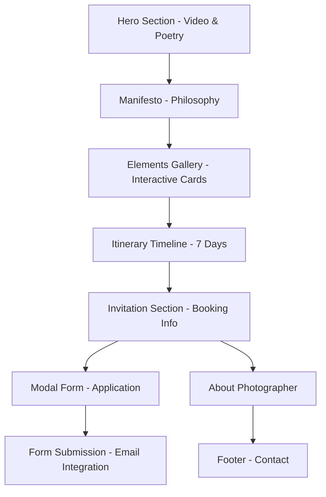

# The Sertão Photographic Expedition - Product Requirements Document

## 1. Product Overview

The Sertão Photographic Expedition is a premium landing page for an exclusive 7-day photography journey into Brazil's Sertão region, limited to only 5 photographers. The website emphasizes intimacy, exclusivity, and artistic philosophy over commercial sales tactics, targeting serious documentary photographers seeking authentic cultural immersion.

The product aims to attract high-quality participants through poetic storytelling and minimalist design, positioning the expedition as a transformative artistic experience rather than a typical photography tour.

## 2. Core Features

### 2.1 User Roles

| Role | Registration Method | Core Permissions |
|------|---------------------|------------------|
| Visitor | Direct website access | Can browse all content, view gallery, read information |
| Interested Photographer | Form submission via "Request an Invitation" | Can submit application with portfolio link for consideration |

### 2.2 Feature Module

Our Sertão Expedition landing page consists of the following main sections:

1. **Hero Section**: 4K video background with animated poetic text and scroll interaction
2. **Manifesto Section**: Full-screen dramatic photo with philosophy overlay text
3. **Elements Gallery**: Interactive 3-card gallery with parallax effects
4. **Itinerary Timeline**: Minimalist 7-day vertical timeline with poetic descriptions
5. **Invitation Section**: Exclusive booking information with modal form
6. **About Photographer**: Personal philosophy and credentials presentation
7. **Footer**: Minimalist contact information with floating widget

### 2.3 Page Details

| Page Name | Module Name | Feature description |
|-----------|-------------|---------------------|
| Hero Section | Video Background | Display 4K autoplay video with mobile fallback image, muted and looped |
| Hero Section | Animated Text | Show poetic phrases in fade-in sequence: "Some places are not photographed. They are felt." followed by expedition title |
| Hero Section | Scroll Interaction | Enable smooth scroll-down navigation without visible buttons |
| Manifesto Section | Background Image | Display full-screen dramatic black and white photograph |
| Manifesto Section | Philosophy Text | Show minimalist overlay text with fade-in on scroll: philosophy about receiving vs taking photographs |
| Elements Gallery | Interactive Cards | Present 3 full-screen cards with parallax reveal on scroll |
| Elements Gallery | Card Content | Display large photos with poetic titles (e.g., "THE LIGHT") and short descriptive text |
| Itinerary Timeline | Vertical Timeline | Show 7-point vertical line representing expedition days |
| Itinerary Timeline | Day Descriptions | Display poetic titles (e.g., "Day Two: The Vaqueiro's Gaze") with subtexts and smooth scroll animations |
| Invitation Section | Exclusivity Message | Emphasize intimate expedition for only 5 photographers with resonance-based invitation |
| Invitation Section | Information Grid | Present clean grid with dates (October 12–18, 2026), participant limit, and investment details |
| Invitation Section | CTA Button | Single "Request an Invitation" button opening modal form |
| Invitation Section | Modal Form | Collect name, email, and portfolio link with email service integration |
| About Photographer | Portrait Display | Show minimalist photographer portrait |
| About Photographer | Philosophy Text | Present photographer's artistic philosophy and credentials (not resume format) |
| About Photographer | Social Links | Provide discrete Instagram/portfolio links |
| Footer | Contact Information | Display centered project/photographer name with subtle social icons |
| Footer | Floating Widget | Show "+" icon expanding to Messenger, Instagram, and Email options |

## 3. Core Process

**Visitor Journey Flow:**
Visitors land on the hero section with immersive video background and are drawn in by poetic messaging. They scroll through the manifesto to understand the expedition philosophy, explore the interactive gallery showcasing Sertão elements, review the 7-day timeline, and ultimately reach the invitation section where exclusivity is emphasized. Interested photographers submit their information through the modal form, while others can learn about the photographer's background before accessing contact information in the footer.

## 4. User Interface Design

### 4.1 Design Style

- **Primary Colors**: Deep earth tones (warm browns, ochre) with high contrast black and white
- **Secondary Colors**: Muted desert palette (sage, sand, charcoal)
- **Button Style**: Minimalist rectangular with subtle hover effects, no 3D or heavy styling
- **Typography**: Elegant serif fonts for poetic titles and headings, clean sans-serif for body text
- **Layout Style**: Full-screen sections with generous white space, card-based gallery, vertical timeline
- **Icons**: Subtle line icons, minimal and geometric style

### 4.2 Page Design Overview

| Page Name | Module Name | UI Elements |
|-----------|-------------|-------------|
| Hero Section | Video Background | Full viewport 4K video with subtle overlay, mobile-optimized with static fallback |
| Hero Section | Typography | Large serif titles with fade-in animations, centered layout with ample spacing |
| Manifesto Section | Background | Dramatic full-screen B&W photography with dark overlay for text readability |
| Manifesto Section | Text Overlay | Minimalist white text with generous line spacing, fade-in on scroll trigger |
| Elements Gallery | Card Layout | Full-screen cards with large imagery, parallax scrolling effects, minimal text overlay |
| Itinerary Timeline | Visual Design | Elegant vertical line with circular day markers, left-aligned content with smooth animations |
| Invitation Section | Information Grid | Clean 3-column layout with typography hierarchy, single prominent CTA button |
| Invitation Section | Modal Design | Centered overlay with minimal form fields, subtle shadows and clean typography |
| About Photographer | Portrait Layout | Large centered portrait with text below, discrete social link styling |
| Footer | Minimalist Design | Centered content with subtle icon styling, floating widget with smooth expand animation |

### 4.3 Responsiveness

The website follows a mobile-first approach with desktop enhancement. Touch interactions are optimized for mobile devices, including swipe gestures for gallery navigation and touch-friendly form elements. Video backgrounds automatically switch to optimized static images on mobile devices to ensure fast loading and battery efficiency. All animations and parallax effects are performance-optimized for mobile devices.