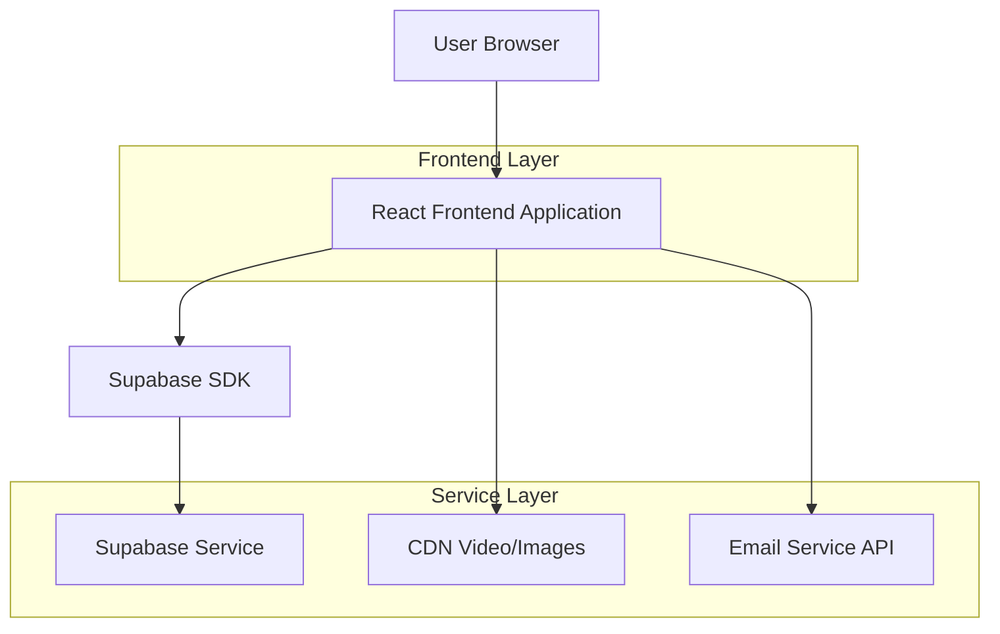
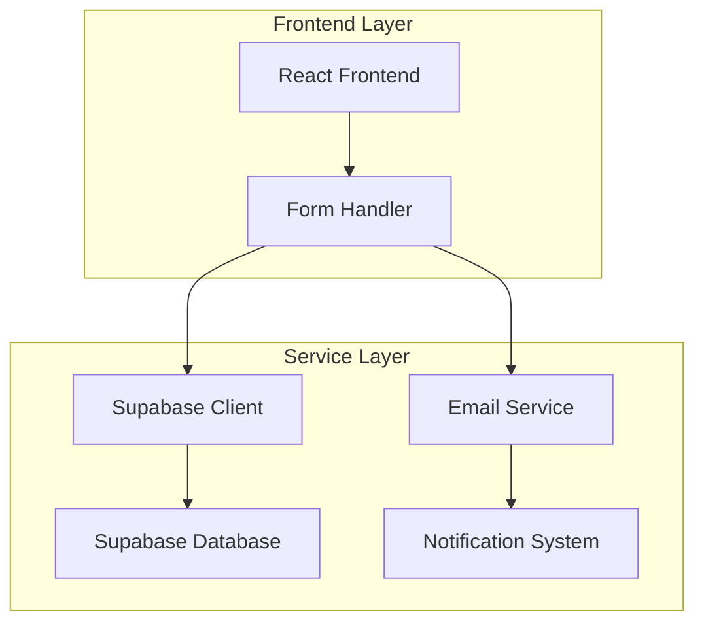
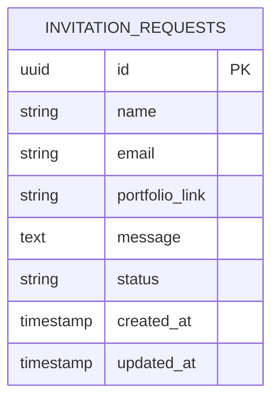

# The Sertão Photographic Expedition - Technical Architecture Document

## 1. Architecture Design



## 2. Technology Description

* Frontend: React\@18 + Vite + Tailwind CSS\@3 + Framer Motion

* Backend: Supabase (for form data storage and email integration)

* CDN: Cloudflare or BunnyCDN for video and image hosting

* Email Service: Brevo/SendGrid for form submissions

## 3. Route Definitions

| Route | Purpose                                                                                                   |
| ----- | --------------------------------------------------------------------------------------------------------- |
| /     | Single-page application with all sections (Hero, Manifesto, Gallery, Timeline, Invitation, About, Footer) |

## 4. API Definitions

### 4.1 Core API

Form submission for expedition invitation requests

```
POST /api/invitation-request
```

Request:

| Param Name      | Param Type | isRequired | Description                                 |
| --------------- | ---------- | ---------- | ------------------------------------------- |
| name            | string     | true       | Full name of the photographer               |
| email           | string     | true       | Contact email address                       |
| portfolio\_link | string     | true       | Link to photographer's portfolio or website |
| message         | string     | false      | Optional message from the applicant         |

Response:

| Param Name | Param Type | Description                   |
| ---------- | ---------- | ----------------------------- |
| success    | boolean    | Status of form submission     |
| message    | string     | Confirmation or error message |

Example Request:

```json
{
  "name": "Maria Silva",
  "email": "maria@example.com",
  "portfolio_link": "https://mariasilva.photography",
  "message": "I'm deeply moved by the philosophy of receiving photographs rather than taking them."
}
```

Example Response:

```json
{
  "success": true,
  "message": "Your invitation request has been received. We will review your portfolio and contact you within 48 hours."
}
```

## 5. Server Architecture Diagram



## 6. Data Model

### 6.1 Data Model Definition



### 6.2 Data Definition Language

Invitation Requests Table (invitation\_requests)

```sql
-- Create table
CREATE TABLE invitation_requests (
    id UUID PRIMARY KEY DEFAULT gen_random_uuid(),
    name VARCHAR(255) NOT NULL,
    email VARCHAR(255) NOT NULL,
    portfolio_link TEXT NOT NULL,
    message TEXT,
    status VARCHAR(50) DEFAULT 'pending' CHECK (status IN ('pending', 'reviewed', 'accepted', 'declined')),
    created_at TIMESTAMP WITH TIME ZONE DEFAULT NOW(),
    updated_at TIMESTAMP WITH TIME ZONE DEFAULT NOW()
);

-- Create indexes
CREATE INDEX idx_invitation_requests_email ON invitation_requests(email);
CREATE INDEX idx_invitation_requests_status ON invitation_requests(status);
CREATE INDEX idx_invitation_requests_created_at ON invitation_requests(created_at DESC);

-- Row Level Security (RLS) policies
ALTER TABLE invitation_requests ENABLE ROW LEVEL SECURITY;

-- Allow anonymous users to insert (for form submissions)
CREATE POLICY "Allow anonymous insertions" ON invitation_requests
    FOR INSERT TO anon
    WITH CHECK (true);

-- Allow authenticated users (admin) to view all
CREATE POLICY "Allow authenticated users to view all" ON invitation_requests
    FOR SELECT TO authenticated
    USING (true);

-- Allow authenticated users to update status
CREATE POLICY "Allow authenticated users to update" ON invitation_requests
    FOR UPDATE TO authenticated
    USING (true);

-- Grant permissions
GRANT INSERT ON invitation_requests TO anon;
GRANT ALL PRIVILEGES ON invitation_requests TO authenticated;
```

## 7. Performance Optimization

### 7.1 Frontend Optimizations

* Lazy loading for images and video content

* Code splitting for Framer Motion animations

* Optimized video formats (WebM, MP4) with progressive loading

* Image optimization with WebP format and responsive sizing

* Preload critical fonts and above-the-fold content

### 7.2 CDN Strategy

* Host 4K video files on Cloudflare or BunnyCDN

* Implement adaptive bitrate streaming for different connection speeds

* Use responsive images with srcset for different screen sizes

* Cache static assets with long expiration times

### 7.3 Accessibility (ADA Compliance)

* Alt text for all images and video content

* Keyboard navigation support for all interactive elements

* High contrast ratios (minimum 4.5:1 for normal text)

* Screen reader compatibility with semantic HTML

* Focus indicators for all interactive elements

* Reduced motion preferences support

### 7.4 SEO Implementation

* Meta title: "The Sertão Photographic Expedition - Exclusive 7-Day Photography Journey"

* Meta description: "A 7-day immersive photography journey into Brazil's Sertão. Limited to 5 photographers. October 12–18, 2026."

* Keywords: Brazil photography expedition, Sertão photo journey, documentary photography retreat

* Open Graph tags for social media sharing

* Structured data markup for events

* Optimized loading performance for Core Web Vitals

